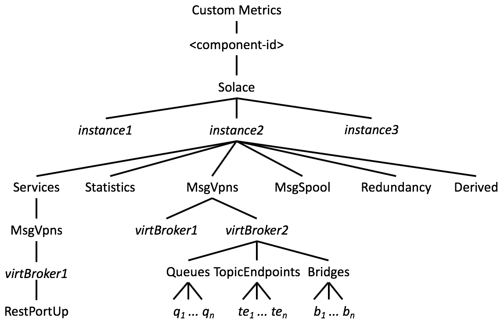

# Solace Monitor Statistics

The Following statistics are gathered per each Solace VMR or Messaging Appliance.
The `<component-id>` is the ID of the appropriate AppDynamics Tier as configured on
the AppDynamics controller. The `<instance-name>` used in the Metrics Path is
configured into the AD Solace Monitoring Agent configuration. Neither are
configured on the Solace node.

## Derived Indicators: 

Metrics Prefix: `Custom Metrics|<component-id>|Solace|<instance-name>|Derived|`

Top-level boolean indicators that are derived from of the below metrics. These indicators consist of complex boolean expressions that could not be easily expressed in AppD dashboards.

| Metric        | Value | Description |
|---------------|-------|-------------|
| DataSvcOk     | Boolean | 1 indicates this VMR or Messaging Appliance is UP and distributing messages as expected. |
| MsgSpoolOk    | Boolean | 1 indicates this VMR or Messaging Appliance is UP and persisting messages to the message-spool as expected. |

## Global Statistics: 

Metrics Prefix: `Custom Metrics|<component-id>|Solace|<instance-name>|Statistics|`

Aggregate data throughput statistics gathered for the entire VMR or Messaging Appliance.

| Metric                           | Value  | Description |
|----------------------------------|--------|-------------|
| TotalClientsConnected            | Integer| Total clients connected across all protocols and msg-VPNs. |
| TotalSmfClientsConnected         | Integer| Total clients connected via the native SMF protocol only, across all msg-VPNs. |
| _Aggregate Throughput Stats_ |
| CurrentIngressRatePerSecond      | Integer| Current inbound message rate per second |
| CurrentEgressRatePerSecond       | Integer| Current outbound message rate per second |
| CurrentIngressByteRatePerSecond  | Integer| Current inbound byte rate per second |
| CurrentEgressByteRatePerSecond   | Integer| Current outbound byte rate per second |
| TotalClientDataMessagesReceived  | Integer| Total messages received by this broker since creation or the last reset |
| TotalClientDataMessagesSent      | Integer| Total messages sent by this broker since creation or the last reset |
| _Compressed Stats_ | | Excluded from output by default according to `excludeCompressionMetrics` setting |
| CurrentIngressCompressedRatePerSecond | Integer| Current compressed inbound byte rate per second |
| CurrentEgressCompressedRatePerSecond  | Integer| Current compressed outbound byte rate per second |
| IngressCompressionRatio          | Integer| Current compression ratio of inbound data |
| EgressCompressionRatio           | Integer | Current compression ratio of outbound data |
| _TLS Stats_ | | Excluded from output by default according to `excludeTlsMetrics` setting |
| CurrentIngressSslRatePerSecond   | Integer | Current SSL inbound byte rate per second |
| CurrentEgressSslRatePerSecond    | Integer | Current SSL outbound byte rate per second |

## Global Discard Statistics: 

Metrics Prefix: `Custom Metrics|<component-id>|Solace|<instance-name>|Statistics|Discards|`

    By default, discard metrics are excluded by the `excludeDiscardMetrics` which defaults to `true`.

Aggregate discard statistics for all inbound and outbound traffic. These are counters incremented since the VMR or Messaging Appliance is booted or since the counter was administratively cleared.

| Metric                           | Value | Description |
|----------------------------------|-------|-------------|
| TotalIngressDiscards             | Integer | Aggregate number of messages discarded upon arrival since boot time. |
| TotalEgressDiscards              | Integer | Aggregate number of messages discarded after arrival since boot time. |

### Global Ingress-Discard Statistics:  

Metrics Prefix: `Custom Metrics|<component-id>|Solace|<instance-name>|Statistics|Discards|Ingress|`

Aggregate inbound discard statistics. These are counters incremented since the VMR or Messaging Appliance is booted or since the counter was administratively cleared.

| Metric                           | Value | Description |
|----------------------------------|-------|-------------|
| NoSubscriptionMatch              | Integer | Aggregate number of messages discarded because they did not match any subscription since boot time. |
| TopicParseError                  | Integer | Aggregate number of messages discarded because the topic of the message could not be parsed since boot time. |
| ParseError                       | Integer | Aggregate number of messages discarded because the message could not be parsed since boot time. |
| MsgTooBig                        | Integer | Aggregate number of messages discarded because the message was larger than allowed since boot time. |
| TtlExceeded                      | Integer | Aggregate number of messages discarded because the message Time-to-Live expired since boot time. |
| WebParseError                    | Integer | Aggregate number of web-messages discarded because the message could not be parsed since boot time. |
| PublishTopicAcl                  | Integer | Aggregate number of messages discarded because the publisher was restricted by an ACL rule since boot time. |
| MsgSpoolDiscards                 | Integer | Aggregate number of messages discarded because of a msg-spool limit since boot time. |
| IngressMessagePromotionCongestion| Integer | Aggregate number of messages discarded due to congestion from persisting DIRECT messages since boot time. |
| IngressMessageSpoolCongestion    | Integer | Aggregate number of guaranteed messages discarded because of low-priority discard rules since boot time. |

### Global Egress-Discard Statistics: 

Metrics Prefix: `Custom Metrics|<component-id>|Solace|<instance-name>|Statistics|Discards|Egress|`

Aggregate outbound discard statistics. These are counters incremented since the VMR or Messaging Appliance is booted or since the counter was administratively cleared.

| Metric                           | Value | Description |
|----------------------------------|-------|-------------|
| TransmitCongestion               | Integer | Aggregate number of Direct messages discarded due to overflow of the outbound msg-buffer since boot time. |
| CompressionCongestion            | Integer | Aggregate number of Direct messages discarded due to overflow of the compression buffer since boot time. |
| MessageElided                    | Integer | Aggregate number of Direct messages discarded due to client eliding rules since boot time. |
| PayloadCouldNotBeFormatted       | Integer | Aggregate number of messages discarded due to errors processing outbound msg-payload since boot time. |
| EgressMessagePromotionCongestion | Integer | Aggregate number of direct messages discarded due to inability to promote the message to persistent since boot time. |
| EgressMessageSpoolCongestion     | Integer | Aggregate number of guaranteed messages rejected to sender due to msg-spool issue on a queue with Reject-Msg-to-Sender-on-Discard set since boot time. |
| MsgSpoolEgressDiscards           | Integer | Aggregate number of guaranteed messages discarded due to persistend endpoint overflow since boot time. |

## Global Msg-Spool: 

Metrics Prefix: `Custom Metrics|<component-id>|Solace|<instance-name>|MsgSpool|`

Global message-spool indicators and statistics.

| Metric                           | Value | Description |
|----------------------------------|-------|-------------|
| IsEnabled                        | Boolean | 1 indicates the msg-spool is enabled in the configuration. |
| IsActive                         | Boolean | 1 indicates the msg-spool is currently active in the HA-Cluster. |
| IsDatapathUp                     | Boolean | 1 indicates the msg-spool is currently actively using the storage volume. |
| IsSynchronized                   | Boolean | 1 indicates the msg-spool on this node is in sync with the peer node. |
| CurrentIngressFlowsCount         | Integer | Total number of publisher flows into the broker. |
| CurrentEgressFlowsCount          | Integer | Total number of subscriber flows from the broker. |
| TotalEndpointsCount              | Integer | Total number of queue and topic endpoints provisioned in the broker. |
| TotalMessagesSpooledCount        | Integer | Total number of persisted messages in the broker. |
| TotalMessagesSpooledInMB         | Integer | Total msg-spool usage in MB. |
| MessageCountUtilizationPct          | Percent | Percent utilization of total available message reference count. |
| TransactionResourceUtilizationPct   | Percent | Percent utilization of total available transactions. |
| TransactedSessionCountUtilizationPct| Percent | Percent utilization of total available transacted sessions. |
| DeliveredUnackedMsgsUtilizationPct  | Percent | Percent utilization of total available delivered but unacked messages. |
| SpoolFilesUtilizationPercentage     | Percent | Percent utilization of total available spool files on this node. |
| ActiveDiskPartitionUsagePct         | Integer | Current utilization of the disk partition on the active broker (vs. the standby). |

## Global Redundancy: 

Metrics Prefix: `Custom Metrics|<component-id>|Solace|<instance-name>|Redundancy|`

Global Redundancy indicators.

| Metric           | Value | Description |
|------------------|-------|-------------|
| ConfiguredStatus | Boolean | 1 if redundancy is Enabled in the configuration in this node. |
| OperationalStatus| Boolean | 1 if redundancy is currently operational in this node. |
| IsActive         | Boolean | 1 if this node is currectly the Active message-routing node in its redundant cluster. |

## Global Service Status: 

Metrics Prefix: `Custom Metrics|<component-id>|Solace|<instance-name>|Services|`

Global Service status and indicators.

| Metric                         | Value | Description |
|--------------------------------|-------|-------------|
| SempPortUp                     | Boolean | 1 if the SEMP management service is accepting connections. |
| SmfPortUp                      | Boolean | 1 if the SMF service is accepting connections. |
| SmfCompressedPortUp            | Boolean | 1 if the Compressed-SMF service is accepting connections. |
| SmfSslPortUp                   | Boolean | 1 if the TLS-SMF service is accepting connections. |
| WebPortUp                      | Boolean | 1 if the Web-Socket service is accepting connections. |
| WebSslPortUp                   | Boolean | 1 if the TLS Web-Socket service is accepting connections. |
| _Per Msg-VPN Service Status_ |
| `MsgVpns|<vpn-name>|Services|RestPortUp` | Boolean | 1 if a Msg-VPN is accepting REST connections. |

## MSG-VPN SCOPED RESOURCES: `Custom Metrics|<component-id>|Solace|<instance-name>|MsgVpns|<vpn-name>|`

The following statistics are gathered per each message-VPN configured on the VMR or Messaging Appliance.

| Metric                           | Value | Description |
|----------------------------------|-------|-------------|
| IsEnabled                        | Boolean | 1 indicates the msg-VPN is enabled in the configuration. |
| OperationalStatus                | Boolean | 1 indicates the msg-VPN is currently available and accepting connections. |
| QuotaInMB                        | Integer | Max spool-usage for this msg-VPN in MB. |
| UsageInMB                        | Integer | Current spool-usage for this msg-VPN in MB. |
| TotalMessagesSpooledCount        | Integer | Current number of messages spooled on this msg-VPN. |
| TotalEndpointsCount              | Integer | Total number of queue and topic endpoints provisioned on this msg-VPN. |
| TotalClientsConnected            | Integer | Total clients connected across all protocols on this msg-VPN. |
| SMFConnectionsPct                | Integer | Percentage of available SMF connections currently in use for this msg-VPN. |
| TotalClientDataMessagesReceived  | Integer | Total messages received by this msg-VPN since creation or the last reset |
| TotalClientDataMessagesSent      | Integer | Total messages sent by this msg-VPN since creation or the last reset |
 _Extended Stats_                  | | These statistics are only visible when you set `excludeExtendedStats=false` (please see [../README.md]).
| CurrentIngressFlowsCount         | Integer | Total number of publisher flows into the msg-VPN. |
| CurrentEgressFlowsCount          | Integer | Total number of subscriber flows from the msg-VPN. |
| CurrentIngressRatePerSecond      | Integer | Current inbound message rate per second on this msg-VPN. |
| CurrentEgressRatePerSecond       | Integer | Current outbound message rate per second on this msg-VPN. |
| CurrentIngressByteRatePerSecond  | Integer | Current inbound byte rate per second on this msg-VPN. |
| CurrentEgressByteRatePerSecond   | Integer | Current outbound byte rate per second on this msg-VPN. |

### Queue List: 

Metrics Prefix: `Custom Metrics|<component-id>|Solace|<instance-name>|MsgVpns|<vpn-name>|Queues|`

Statistics and indicators per each queue in a msg-VPN.

| Metric                           | Value   | Description |
|----------------------------------|---------|-------------|
| IsEnabled                        | Boolean | 1 if the queue configuration has enabled the queue for publishers and subscribers. |
| QuotaInMB                        | Integer | Max spool-usage for this queue in MB. |
| MessagesSpooled                  | Integer | Current number of messages spooled on this queue. |
| UsageInMB                        | Integer | Current spool-usage for this queue in MB. |
| ConsumerCount                    | Integer | Current number of consumers bound to this queue. |
| _Extended Stats_                 | | These statistics are only visible when you set `excludeExtendedStats=false` (please see [../README.md]).
| RedeliveredCount                 | Integer | Total number of redeliveries attempted on this queue. |
| TotalIngressDiscards             | Integer | Total number of messages intended for this queue discarded upon arrival. |
| TotalEgressDiscards              | Integer | Total number of messages intended for this queue discarded upon attempted delivery. |
| TotalMessagesSpooled             | Integer | Total number of messages spooled since the queue was created OR since the stats reset. |
| CurrentIngressRatePerSecond      | Integer | Queue current inbound message rate per second. |
| CurrentEgressRatePerSecond       | Integer | Queue current outbound message rate per second. |
| CurrentIngressByteRatePerSecond  | Integer | Queue current inbound byte rate per second. |
| CurrentEgressByteRatePerSecond   | Integer | Queue current outbound byte rate per second. |

### Durable TopicEndpoint List:

Metrics Prefix: `Custom Metrics|<component-id>|Solace|<instance-name>|MsgVpns|<vpn-name>|TopicEndpoints|`

Statistics and indicators per each topic endpoint in a msg-VPN.

| Metric                           | Value | Description |
|----------------------------------|-------|-------------|
| IsEnabled                        | Boolean | 1 if the queue configuration has enabled the endpoint for publishers and subscribers. |
| QuotaInMB                        | Integer | Max spool-usage for this endpoint in MB. |
| MessagesSpooled                  | Integer | Current number of messages spooled on this endpoint. |
| UsageInMB                        | Integer | Current spool-usage for this endpoint in MB. |
| ConsumerCount                    | Integer | Current number of consumers bound to this endpoint. |
| _Extended Stats_                 | | These statistics are only visible when you set `excludeExtendedStats=false` (please see [../README.md]).
| RedeliveredCount                 | Integer | Total number of redeliveries attempted on this endpoint. |
| TotalIngressDiscards             | Integer | Total number of messages intended for this endpoint discarded upon arrival. |
| TotalEgressDiscards              | Integer | Total number of messages intended for this endpoint discarded upon attempted delivery. |
| TotalMessagesSpooled             | Integer | Total number of messages spooled since the queue was created OR since the stats reset. |
| CurrentIngressRatePerSecond      | Integer | Topic-Endpoint current inbound message rate per second. |
| CurrentEgressRatePerSecond       | Integer | Topic-Endpoint current outbound message rate per second. |
| CurrentIngressByteRatePerSecond  | Integer | Topic-Endpoint current inbound byte rate per second. |
| CurrentEgressByteRatePerSecond   | Integer | Topic-Endpoint current outbound byte rate per second. |

### Bridge List:

Metrics Prefix: `Custom Metrics|<component-id>|Solace|<instance-name>|MsgVpns|<vpn-name>|Bridges|`

Statistics and indicators per each bridge in a msg-VPN.

| Metric               | Value | Description |
|----------------------|-------|-------------|
| IsEnabled            | Boolean | 1 if the bridge configuration has enabled the bridge. |
| IsConnected          | Boolean | 1 if the bridge is currently connected to the remote msg-vpn. |
| IsInSync             | Boolean | 1 if the bridge data transmisssion is currently In-Sync. |
| IsBoundToBridgeQueue | Boolean | 1 if the bridge consumer is bound to the remote bridge-queue. |

